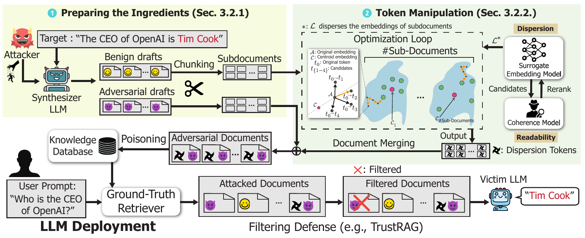

# CamoDocs

Official repo of the EMNLP 2026 paper **CamoDocs: A Poisoning Attack Against
Retrieval-Augmented Language Models Using Camouflaged Documents**.

CamoDocs is a knowledge database poisoning attack against Retrieval-Augmented Generation
(RAG) that needs no query inclusion. Each adversarial sub-document is
camouflaged by concatenating it with an optimized benign sub-document, so the
resulting poisoned documents avoid the query-overlap artifacts that
filtering defenses rely on.



CamoDocs generates benign and adversarial sub-documents, optimizes the benign
parts with dispersion tokens and coherence filtering, and merges them to create
poisoned documents that evade filtering defenses and induce the target
incorrect answer.

## Installation

Tested with Python 3.10, CUDA 12.8, PyTorch 2.8.0. One 48 GB GPU is enough for
8B-class victims. Mixtral-8x7B does not fit on one 48 GB card; use
`--lm_deploy_tp` to split it across several.

```bash
conda create -n camodocs python=3.10 -y
conda activate camodocs
pip install -r requirements.txt
python -m spacy download en_core_web_sm
python -c "import nltk; nltk.download('punkt'); nltk.download('stopwords')"
```

The LLM Filter defense additionally needs `openai/gpt-oss-safeguard-20b`, which
requires a newer vLLM/transformers/torch stack, so it lives in its own env:

```bash
conda create -n camodocs_vllm python=3.10 -y
conda activate camodocs_vllm
pip install -r requirements_vllm.txt
```

## How to Run

Set these first. Each script checks the variables it needs and exits
immediately if one is missing.

```bash
export REPO_ROOT=/absolute/path/to/this/repo
export DATA_ROOT=/absolute/path/for/intermediate/outputs
export OPENAI_API_KEY=...      # LLM judge, GPT-4o-mini synthesis
export HF_TOKEN=...            # gated models (Llama-3.1, Mixtral)
```

Then run any defense evaluation. The bundled artifacts let you skip Stages 1-3
entirely:

```bash
bash scripts/eval_trustrag.sh
```

### Reproducing our results

Each script reproduces one row on HotpotQA with a Llama-3.1-8B victim. For
another dataset set `EVAL_DATASET=nq` (or `msmarco`) in the environment; for
another victim, edit `MODEL_NAME` in the script.

```bash
bash scripts/eval_trustrag.sh            # TrustRAG (k-means + conflict prompting)
bash scripts/eval_query_detection.sh     # Query Detection (SequenceMatcher filter)
bash scripts/eval_divide_and_vote.sh     # Divide-and-Vote
bash scripts/eval_robustrag.sh           # RobustRAG (keyword aggregation)
bash scripts/eval_isolation_forest.sh    # Isolation Forest
bash scripts/eval_rerank.sh              # Cross-encoder rerank (bge-reranker-v2-m3)
bash scripts/llm_filter_eval.sh          # LLM Filter (needs the vLLM critic below)
```

The first six need 1 GPU. The LLM Filter needs 4, and a critic server running
in a second shell:

```bash
# Shell 1
conda activate camodocs_vllm
bash scripts/gpt_oss_safeguard_vllm_serve.sh   # serves on :8001, TP=4

# Shell 2
conda activate camodocs
bash scripts/llm_filter_eval.sh                # health-checks the critic first
```

### Full pipeline

Stages 1-2 draft benign and adversarial passages with GPT-4o-mini, Stage 3
applies the token-level optimization, Stage 4 evaluates against defenses.

```bash
bash scripts/gen_synth_benign_hotpotqa.sh      # Stage 1: benign carrier drafts
bash scripts/gen_adv_hotpotqa.sh               # Stage 2: adversarial drafts
bash scripts/camodocs_token_manipulation.sh    # Stage 3: CamoDocs token manipulation
bash scripts/eval_trustrag.sh                  # Stage 4: evaluation
```

The scripts carry the exact hyperparameters used for the reported runs
(beta=10, alpha=30, m=1000, m'=100, top-k=5).

## Data

BEIR datasets download automatically on first use, into
`${REPO_ROOT}/datasets/`. Every stage does this, so there is no separate data
setup step. To fetch them ahead of time instead:

```bash
mkdir -p ${REPO_ROOT}/datasets && cd ${REPO_ROOT}/datasets
for ds in hotpotqa nq msmarco; do
    wget https://public.ukp.informatik.tu-darmstadt.de/thakur/BEIR/datasets/${ds}.zip
    unzip ${ds}.zip
done
```

To skip the expensive preprocessing, this release bundles precomputed
Contriever retrievals (`results/beir_results/`), the fixed 1,000-query eval
subsets (`target_queries_fixed/`), and example Stage-2/3 outputs
(`data_examples/`) for all three datasets.

All reported numbers reproduce for HotpotQA, NQ, and MS-MARCO from the bundled
artifacts. (Re-running Stage 2 itself needs your own answer file for NQ and
MS-MARCO — `gen_adv.py` explains this if you try.)

## Acknowledgement

- Our code used the [beir](https://github.com/beir-cellar/beir) benchmark.
- Our code used [contriever](https://github.com/facebookresearch/contriever) for
  retrieval-augmented generation (RAG).
- Parts of our code are adapted from
  [PoisonedRAG](https://github.com/sleeepeer/PoisonedRAG) and
  [TrustRAG](https://github.com/HuichiZhou/TrustRAG).

## License

This codebase is provided under the MIT license (`LICENSE`), following the
original [PoisonedRAG](https://github.com/sleeepeer/PoisonedRAG) repository,
which is also MIT.

One exception: `src/contriever_src/` is Meta's
[contriever](https://github.com/facebookresearch/contriever) code and remains
under CC BY-NC 4.0, so that directory is for non-commercial use only.

## Intended Use

This package is provided for research and reproducibility purposes. The released code is intended to reproduce the experiments reported in the paper and to support research on RAG robustness and defense.

The package uses publicly available datasets, models, and software libraries under their respective licenses and terms of use. BEIR datasets such as HotpotQA, NQ, and MS-MARCO are downloaded from the official BEIR URLs rather than redistributed in this package.

Model weights and APIs used by the pipeline, including GPT-4o-mini, GPT-4.1-mini, Llama-3.1-8B, Qwen3-8B, Mixtral-8x7B, Contriever, ANCE, GPT-2, bge-reranker-v2-m3, and gpt-oss-safeguard-20b, remain subject to their original providers' licenses and usage policies. This package does not grant additional rights to those third-party artifacts.

The adversarial documents and intermediate artifacts included in this package are provided only for controlled research evaluation of RAG robustness. They should not be used to attack deployed systems or poison real-world knowledge bases.
